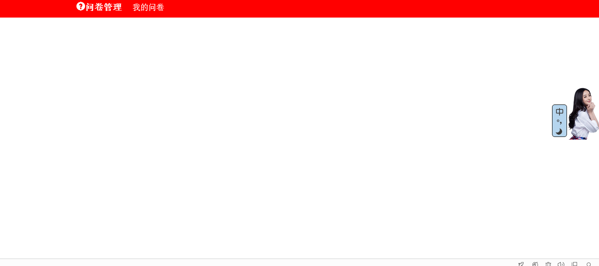

## 在directive.js文件中编写指令和在template文件夹下创建HTML模板

### 编写指令

由于这个导航栏的逻辑比较简单，所以我们就将其控制器一起写在这个指令之内了，这会更加方便。

```bash
angular.module( 'directive', [])
	//我们定义这个指令的名称为navBar，但是我们在页面中引入的时候必须要通过这样的方式——nav-bar，而不是
	//驼峰命名法
	.directive( 'navBar', function() {
		return {
			//可以用作属性和元素
			restrict : 'EA',

			//引入模板文件，注意，这里的相对地址是相对于index.html来说的，而不是这个js文件
			templateUrl : './template/nav-bar.html',
				
			//定义我们的控制器
			constroller : function( $scope ) {
				scope.currentPage = 'manage';
			},
		};
	})
```

现在开始编写模板文件——nav-bar.html，这个模板文件如果有多于一个的元素，那么这些元素都必须包含在一个元素中，这是AngularJS规定的，你可以反过来试一试如果你不这样做会发生什么，我是试过了，所以我会告诉你这的确是AngularJS的一个规则。

```bash
<!--最外层的div使用了一个bootstrap的样式类，和我自己定义的css类-->
<div class="container-fluid myColor">
	<nav class="row">
		<ul class="col-xs-offset-1 myNav">
			<!--
            	作者：qxfnapoleon@163.com
            	时间：2016-07-25
            	描述：当前的页面显示的是什么。这个导航链接的字体样式就会变得更大一些
            -->
			<li ng-class="{showCurrentPage:currentPage=='manage'}">
				<a ng-href=''>
					<span class="glyphicon glyphicon-question-sign"></span>
					问卷管理
				</a>
			</li>

			<!--
				注意看这两个li元素的ng-class里面的内容，再回过头来看一下我们刚才在控制器中定义的内容，
				关于ng-class我就不介绍了，不过我要介绍下面的内容是什么意思，
				他表示如果控制器中currentPage的值为'myInvestigate'，那就让下面的li具有showCurrentPage这个样式的类，
				其中showCurrentPage是我自己定义的css类。
				如果不等于'myInvestigate'，那就看上一个li是否符合条件，上面一个li的解释是一样的。
			-->
			<li ng-class="{showCurrentPage : currentPage=='myInvestigate'}">
				<a ng-href=''>我的问卷</a>
			</li>
		</ul>
	</nav>
</div>
```

最后我们需要看一下我们定义的指令能不能使用了，我们需要在index.html中引入这个指令，走起。

```bash
<body>
	<!--引入导航指令-->
	<nav-bar></nav-bar>
	<!--或者你可以这样，因为我们设置了指令可以作为元素属性来使用-->
	<!-- <nav nav-bar></nav> -->
</body>

```

我们最后来看一下我们自己在CSS定义的样式类是什么样的。我不具体解释怎样来写下面的代码，我知道你应该能看得懂，或者有更好的方案。

```bash
/*让整个页面都有一个底色、字体*/
body{
	background: #EFEFEF;
	font-size:16px;
	font-family: "宋体","微软雅黑", sans-serif;
}
.myColor{
	background: red;
	min-height:20px;
	line-height:100%;
}
.showCurrentPage{
	font-size:20px !important;
	font-weight:bold;
	color:black;
}
/*将li的原本样式去掉*/
li{list-style: none;}

/*让li这个块状元素变成内联元素*/
.myNav li{
	display: inline-block;
	margin-left:20px;
	color:white;
	font-size:18px;
	cursor:pointer;
	padding-top:6px;
	padding-bottom: 6px;
}
.myNav a{
	color:white;
	text-decoration: none;
}

```

我们需要看一下最终的结果了。有一点儿兴奋。
