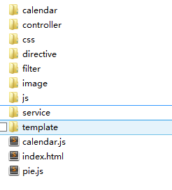

## 文件结构

我觉得这很重要的开始部分就是文件结构了，为了适应我们后面的更多的代码编写，我们将我们的文件结构设置为以下。

project
|
|==> index.html（单页应用的主要主文件）
|
|==> css（存放我们自己写的css样式）
|
|==> js （存放我们自己写的JavaScript代码，虽然不多，但是却也是要使用的）
|
|==> controller（存放控制器的文件）
|
|==> directive（存放AngularJS的指令定义文件，里面的文件是js文件）
|
|==> service（保存AngularJS服务的文件）
|
|==> filter（保存AngularJS过滤器的文件，跟服务差不多）
|
|==> template（保存我们设定指令的时候需要用到的HTML模板）




你可能会疑惑，为什么没有AngularJS和bootstrap文件呢？原因是我比较喜欢使用CDN的方式获取这些文件，这样如果真的放在我的服务器的时候就能稍微减轻我的服务器的压力了（不了解我在说什么，就当我是在说胡话，不了解也罢）。

我们最重要的文件就是index.html文件了，所以我们来看一下它应该怎么写（这是一个大体的框架）。

```bash
<!DOCTYPE html>
<html lang="en" ng-app='investigatePage'>
<head>
	<meta charset="UTF-8">
	<title>Welcome To This Investigate Page</title>
	<!--引入bootstrap文件-->
	<link rel="stylesheet" href="http://apps.bdimg.com/libs/bootstrap/3.3.4/css/bootstrap.min.css" />
</head>
<body>

</body>

	<!--引入AngularJS的主文件-->
	<script src="http://apps.bdimg.com/libs/angular.js/1.4.6/angular.min.js"></script>
</html>
```

其余的js文件我们现在还没不着急引入进来，等我们需要的时候才引入会更好。