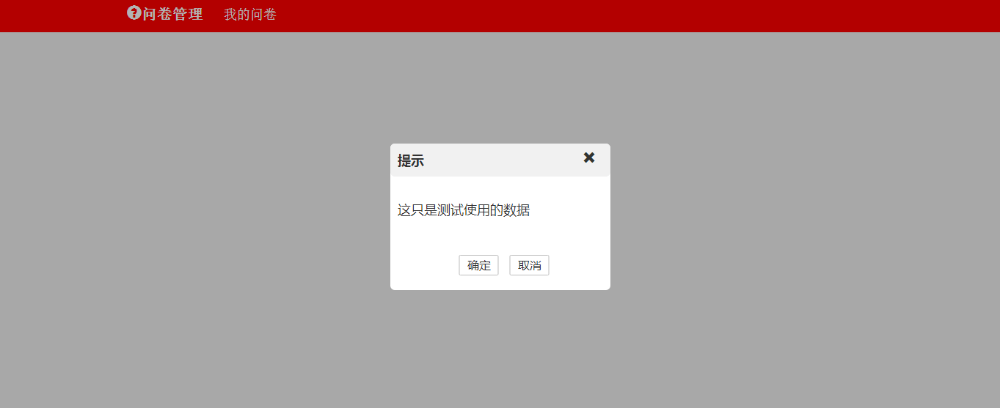

## 走完最后一公里

我们把指令定义好了，指令的模板以及模板的样式都定义好了，现在是时候观看最终效果了。对了，我们还没有定义控制器（controller.js）的内容，不要担心，先看效果。在index.html中这样引入吧！

```bash
<body>
	<nav-bar></nav-bar>
	<prompt-box></prompt-box>
</body>
```

很好，非常的好以及极其的好（出自武林外传），就只现在还没有功能，现在我们就开始去写控制器的内容吧。

```bash
/*依赖于investigateService这个服务，所要在后面添加它的名字*/
angular.module( 'viewerController', ['investigateService'] )
	.controller( 'promptController', function( $scope, queryElement ) {
		$scope.promptBox = {
			_showBox : function() {
				var modifyInfoBackground = queryElement.querySingle( '.deletePromptBackground' );
				var promptBox = queryElement.querySingle( '.promptBox');
				modifyInfoBackground.css( 'display', 'block' );
				promptBox.css( 'display', 'block' );
			},
			_hideBox : function() {
				var modifyInfoBackground = queryElement.querySingle( '.deletePromptBackground' );
				var promptBox = queryElement.querySingle( '.promptBox');
				modifyInfoBackground.css( {'display':'none'} );
				promptBox.css( 'display', 'none' );
			},

			//定义确认和取消按钮的函数
			confirm : function() {
				$scope.promptBox._hideBox();
			},
			cancel : function() {
				$scope.promptBox._hideBox();
			},
			message : '这只是测试使用的数据'
		}
	})
```

在这里我需要解释一下我引入AngularJS的服务的功能，这个功能是查询元素的功能，就是将DOM的API封装一下。我们在控制器中需要使用到它，所以就将其作为依赖方进行引入了。

```bash
//investigateService服务的代码
angular.module( 'investigateService', [] )
	//将查询到的元素转化成angular的类数组
	.service( 'queryElement', function() {
		var doc = document;
		var myObject = {
			querySingle : function( expression ) {
				return angular.element( doc.querySelector( expression ) );
			},
			queryAll : function( expression ) {
				return angular.element( doc.querySelectorAll( expression ) );
			}
		};
		
		return myObject;
	})
```

这时候既然我们使用到了这个服务，所以我们要在index.html文件中引入这个服务的源文件。

```bash
</body>
	<!--引入AngularJS的主文件-->
	<script src="http://apps.bdimg.com/libs/angular.js/1.4.6/angular.min.js"></script>
	<script src="./directive/directive.js"></script>
	<script src="./controller/controller.js"></script>
	<script src="./service/service.js"></script>
	<script>
		//下面传入directive作为AngularJS的依赖模块
		var investigate = angular.module( 'investigatePage', 
										['directive', 'viewerController'] );
	</script>
```

现在你再去刷新一下浏览器，就更逼真了，但是我要告诉你的是，我们设定的控制器我们在后面的时候都会将其删除掉，为什么呢？因为我再设计这个网站的时候不需要使用到这个控制器，或者说我们刚才定义的控制器不足以应对我们后面所需要的逻辑。但是现在为了观看效果，我们还是决定将其写出来。

最后，我们可以结束这一个组件的开发了，可以将它们的样式中的display设置为none了。

